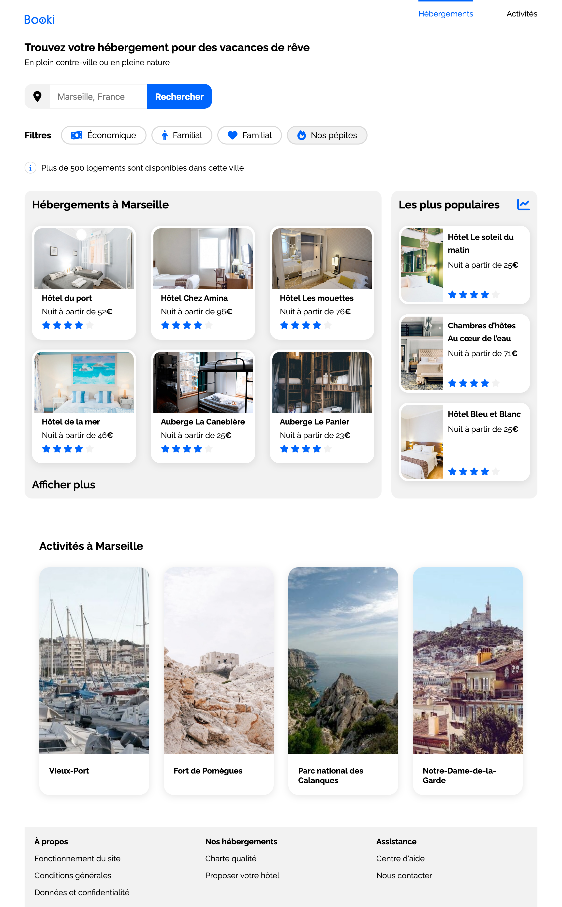

# Booki - Projet de Refonte Front-End

Dans le cadre de ma formation en développement web, j'ai réalisé un projet visant à recréer l'interface front-end d'un
site à partir d'une maquette Figma, avec une attention particulière au responsive design.

[Voir la démo en ligne](https://hichxm.github.io/openclassrooms-booki/)

## 🧩 Contraintes

### Fonctionnel

#### 🔍 Fonction de recherche

- [x] Champ de saisie éditable pour la recherche de villes.
- [x] Inclus dans un formulaire.
- [x] Non-fonctionnelle (interface uniquement).

#### 🔗 Liens "Hébergements" et "Activités"

- [x] Doivent mener vers les sections respectives.
- [x] Présents dans l’en-tête.

#### 🏠📍 Cartes d’hébergements et d’activités

- [x] Entièrement cliquables.
- [x] Liens simulés avec `href="#"`.

#### 🎛️ Filtres de recherche

- [x] Filtrage par thématique (budget, ambiance).
- [x] Couleur change au survol.
- [x] Non-fonctionnels (interface uniquement).

### ⚙️ Contraintes techniques

#### 🖥️ Maquettes

- [x] Trois versions : desktop, tablette, mobile.

#### 📏 Breakpoints

- [x] 1024 px : ordinateurs
- [x] ≥ 768 px : tablettes
- [x] < 768 px : téléphones

#### 📐 Largeur minimale et maximale

- [x] Max : 1440 px (avec marges blanches au-delà).
- [x] Min : 320 px (comportement non garanti en dessous).

🔧 Méthodologie

- [x] Desktop first avec Media Queries.

🧰 Bibliothèques

- [x] Font Awesome pour les icônes.
- [x] Google Fonts - Raleway pour la police.

🎨 Couleurs

- [x] Bleu principal : `#0065FC`
- [x] Bleu clair : `#DEEBFF`
- [x] Gris de fond : `#F2F2F2`

🧱 Mise en page

- [x] Utiliser Flexbox.

🏷️ Balises sémantiques requises

- [x] `header`, `nav`, `main`, `section`, `article`, `footer`, `h1-h2-h3`.

✅ Validité du code

- [x] Valide **W3C HTML & CSS**.
- [x] Pas de CSS en ligne dans le HTML.
- [x] Pas de duplication de code HTML.
- [x] Cibler avec des classes CSS, pas des noms d’éléments HTML.
- [x] Réutilisation des classes pour éléments identiques.

🌐 Compatibilité

- [x] Dernières versions de **Google Chrome** et **Mozilla Firefox**.

🚫 Interdictions

- [x] Pas de **framework CSS** (ex. Bootstrap, Tailwind).
- [x] Pas de **préprocesseurs CSS** (ex. Sass, Less).
- [x] Aucun **JavaScript**.

## Aperçu

## Maquette

La maquette Figma est conçue pour s'adapter aux différents supports et doit être reproduite avec un design responsive :

- [Version Desktop](./doc/layout-desktop.png)
- [Version Tablette](./doc/layout-tablet.png)
- [Version Mobile](./doc/layout-mobile.png)

[Accéder à la maquette sur Figma](https://www.figma.com/design/r9YJyUkpVdrxzBBKGH7reY)
